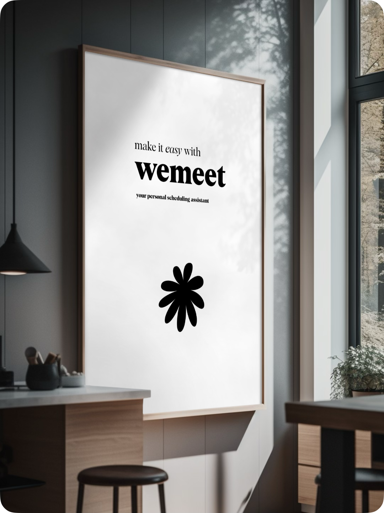

# Welcome to wemeet 👋

your personal scheduling assistant, designed to make meeting management easy and efficient.

  

## Our Mission

To provide a user-friendly and efficient solution for managing meetings, enhancing productivity, and ensuring seamless communication across various platforms.

### 🌟 Key Features

- **Smart Scheduling**: Show your availability in just two clicks
- **Calendar Sync**: Seamless integration with external calendars
- **Real-time Notifications**: Stay updated with instant alerts
- **User-friendly Interface**: Intuitive design for easy navigation

## 🛠️ Our Tech Stack

  

## 📈 Project Status

wemeet is currently in the early stages of active development. Our team is working hard in their spare time to bring you the best meeting management experience possible. We're aiming to release a minimum viable product by the end of summer 2024. 

Stay tuned for updates!

## 🚀 Roadmap

- [x] Project initiation and planning
- [ ] 🚧 Core functionality development (In progress)
- [ ] Integration with external calendars
- [ ] User testing and feedback collection
- [ ] MVP release (Expected: End of Summer 2024)

## 📬 Contact Us

We're in the process of setting up our official communication channels. In the meantime, you can reach us through GitHub issues for any questions or suggestions.

## 📄 License

This project is licensed under the Creative Commons Attribution-NonCommercial 4.0 International License.

---

  Made with ❤️ by the wemeet team

<!--

**Here are some ideas to get you started:**

🙋‍♀️ A short introduction - what is your organization all about?
🌈 Contribution guidelines - how can the community get involved?
👩‍💻 Useful resources - where can the community find your docs? Is there anything else the community should know?
🍿 Fun facts - what does your team eat for breakfast?
🧙 Remember, you can do mighty things with the power of [Markdown](https://docs.github.com/github/writing-on-github/getting-started-with-writing-and-formatting-on-github/basic-writing-and-formatting-syntax)
-->
